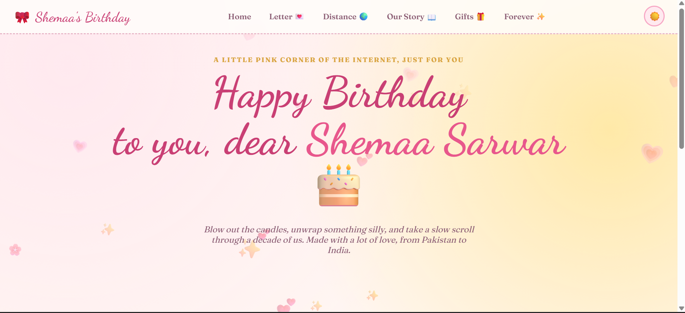
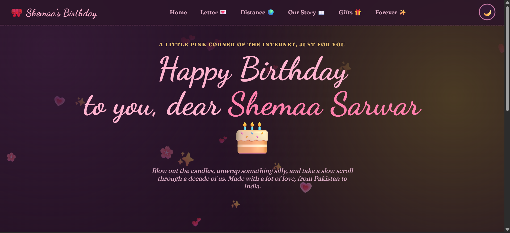
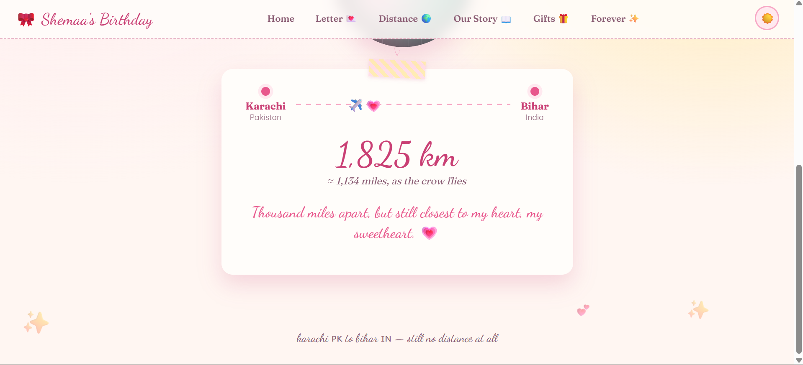
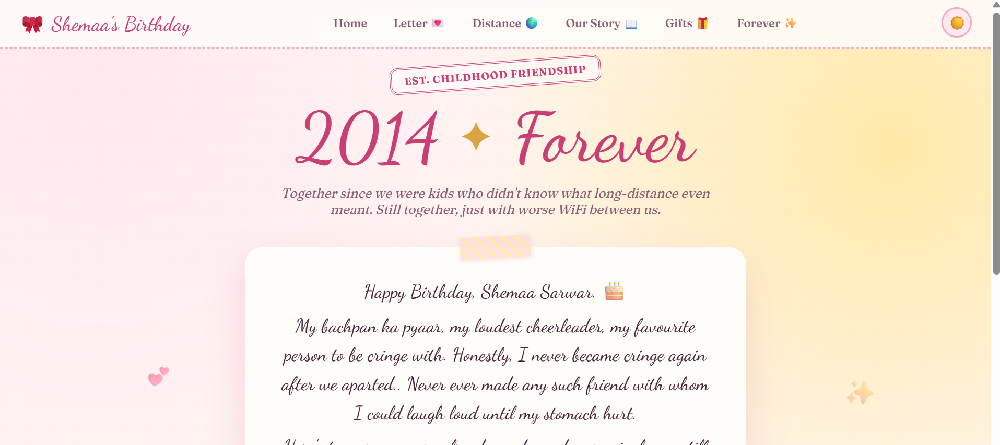
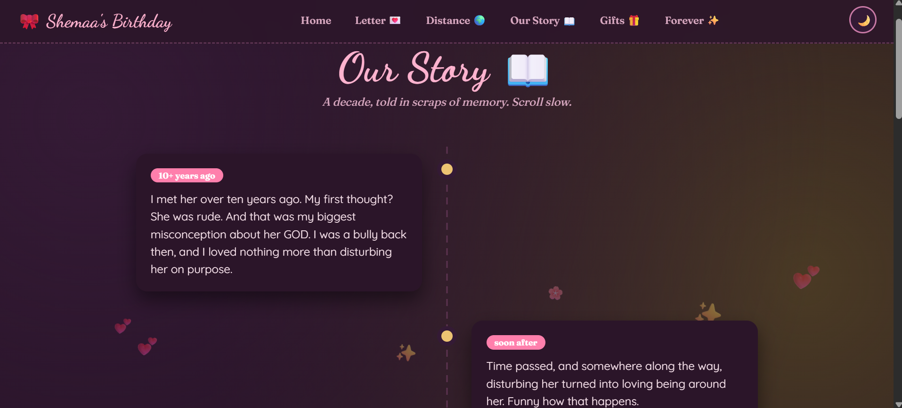

# Happy Birthday Dear Shemaa

> Tags: Birthday, Scrapbook, Multi-page Greeting Site, HTML/CSS/JavaScript, Romantic Web Design

Live demo: [happybirthdaydearshemaa.netlify.app](https://happybirthdaydearshemaa.netlify.app/)

A handcrafted birthday website made as a personal scrapbook for Shemaa. The project uses a soft pink visual theme, animated decorations, and multiple pages to tell a small story across the site.

## Screenshots

---

---

---

---

## Features

- Animated birthday home page with cake, candles, gifts, balloons, and confetti.
- Multi-page experience with navigation between the different sections.
- Theme toggle with saved preference in `localStorage`.
- Responsive layout with mobile navigation support.
- Decorative scrapbook-style design with soft gradients, script typography, and layered UI elements.

## Pages

- `index.html` - Birthday landing page and candle wish interaction.
- `letter.html` - A personal letter page.
- `distance.html` - A page about the distance between you two.
- `story.html` - Your story together.
- `gifts.html` - Gift-themed page.
- `forever.html` - A forever / memory page.

## Project Structure

- `index.html` - Main entry page.
- `letter.html` - Letter section.
- `distance.html` - Distance section.
- `story.html` - Story section.
- `gifts.html` - Gifts section.
- `forever.html` - Forever section.
- `style.css` - Shared styling for the whole site.
- `main.js` - Shared behavior for theme, navigation, and floating hearts.

## How To Run

1. Open the folder in VS Code or any file explorer.
2. Open `index.html` in a browser.
3. Navigate through the pages using the site menu.

If you want a local server instead of opening the file directly, use any simple static server you prefer.

## Customization

- Replace the screenshot placeholders in the section above with real images.
- Update the text in each HTML file to personalize the message further.
- Adjust colors, fonts, or animations in `style.css`.
- Edit the confetti and candle interaction in `index.html` if you want a different celebration effect.

## Contact

- Email: [maryambano.official@gmail.com](mailto:maryambano.official@gmail.com)
- LinkedIn: [www.linkedin.com/in/realmaryambano](https://www.linkedin.com/in/realmaryambano)

## License

This project is licensed under the MIT License. See [LICENSE](LICENSE) for the full text.

## Credits

Made with love by Maryam Bano.
